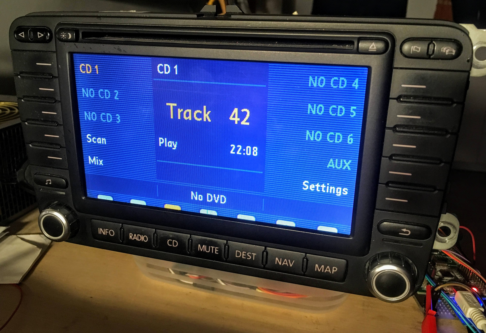
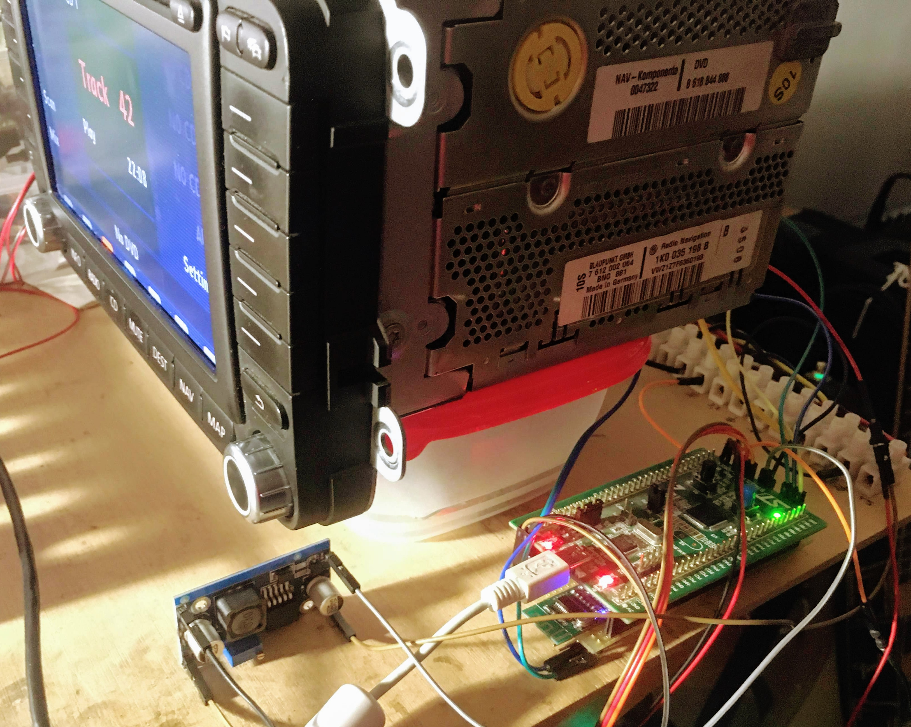
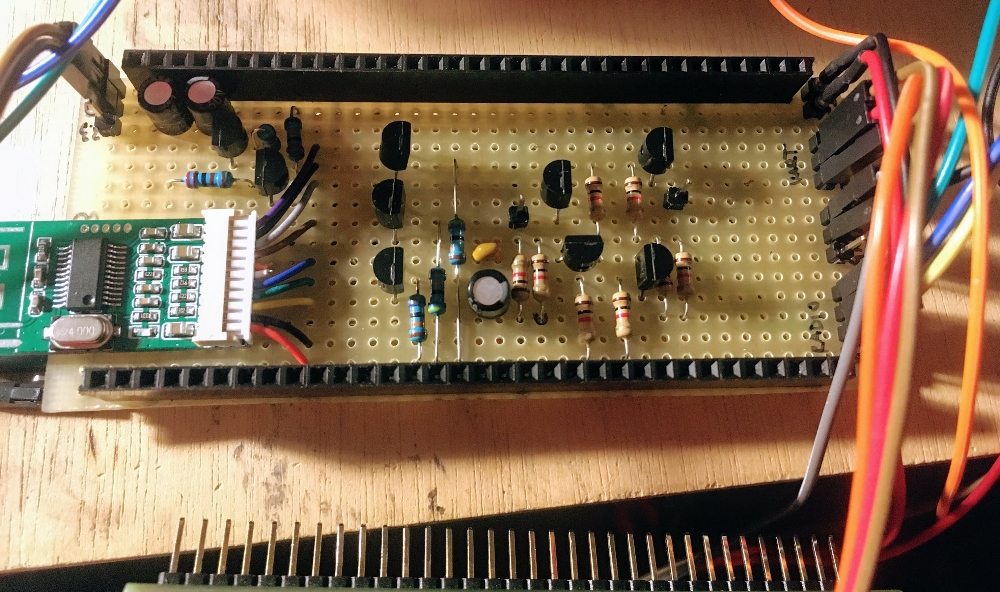

# RNS-MFD2-Bluetooth
RNS MFD2 Bluetooth CD Changer emulator based on STM32L100 + KCX_BT002  
Damogran Labs: (https://damogranlabs.com/?p=2000)[https://damogranlabs.com/?p=2000]  
Author: Domen Jurkovic, Feb 2020

# Firmware
... can be found in cdcEmulatorSTM32L2 folder, including VS Code workspace. Code is somewhat commented, but feel free to ask if there is anything unclear.  
Since code is generated with CubeMX, it shouldn't be very hard to port solution to some other STM32 microcontroller, using the same LL libs.

# Sniffed data
This CD Changer I/O data was recorded with PulseView and custom decoder, following their guide. To use decoder, copy _rnsMfd2_ folder to _Program Files (x86)\sigrok\PulseView\share\libsigrokdecode\decoders_ folder.  
Exports (.sr -> .data -> .txt) files are post analysis of recorded data for easier user inspection of the data. They were generated with _dataAnalyzer.py_ run on a specific PulseView .sr file.  
**NOTE:** do not take exports and my comments as an absolute true facts. Instead, see the code and Damogran Labs blog post for more info.

# Screenshots
  
  
  
